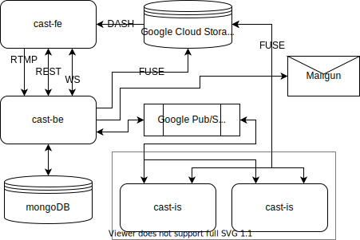

 

## Video Sharing and Live Streaming Platform

A project for INFS3202 course by Danny August Ramaputra

> Visit now at [cast.daystram.com](https://cast.daystram.com)!

[GitLab Repository](https://gitlab.com/daystram/cast)

# Services
The application comes in three parts:

|Name|Code Name|Stack|
|----|:-------:|-----|
|Back-end|`cast-be`|[Go](https://golang.org/), [BeeGo](https://beego.me/), [MongoDB](https://www.mongodb.com/)|
|Front-end|`cast-fe`|JavaScript, [ReactJS](https://beego.me/)|
|Transcoder|`cast-is`|[Go](https://golang.org/), [FFMpeg](https://ffmpeg.org/)|

# Third-Party Services
A number of external services are used in tandem with *cast*:
* [Google Pub/Sub](https://cloud.google.com/pubsub)
* [Google Cloud Storage](https://cloud.google.com/storage)
* [Mailgun](https://www.mailgun.com/)

# Architecture

# Deployment
Utilizing GitLab CI, *cast* services are built and containerized for deployment into [Google Compute Engine]().
